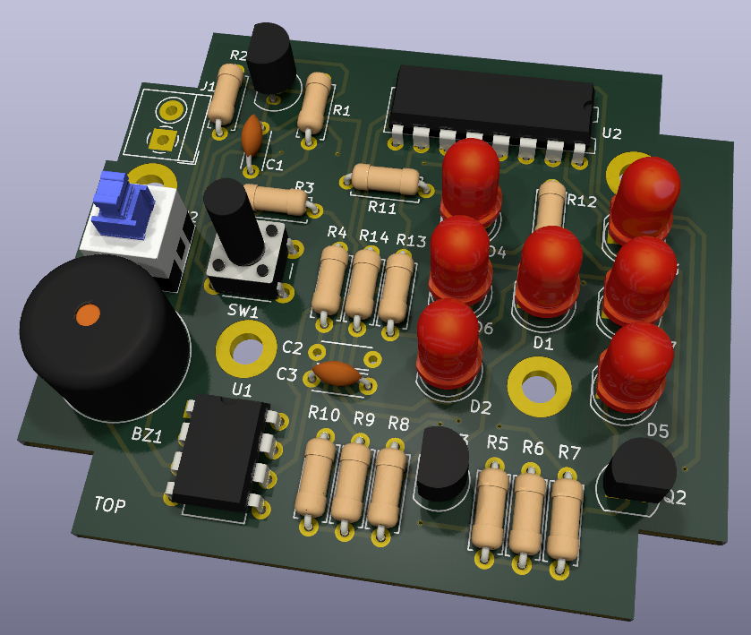
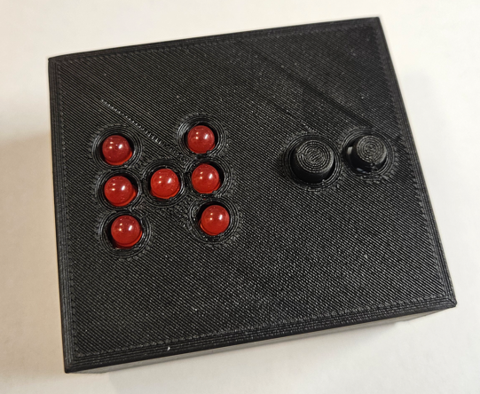

# Electronic dice
This is the construction of electronic dice for RedNetCon technological conference
workshop. It is based on NE555 timer and 4017 logical circuit. All components are 
in THT packages.

PCB is 2-layer and was designed using KiCad 8. Fabrication output for JLCPCB is in gerber folder.

Happy soldering!

